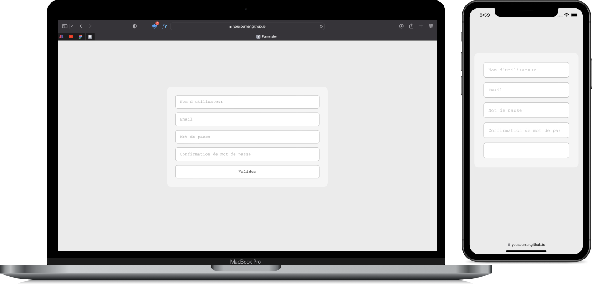

Il s'agit d'un formulaire avec validation en `HTML`, `CSS`, et `JavaScript`.

Tester en cliquant sur l'image ci-dessous ou sur le lien en bas de la section `About`.

<a href = "https://yousoumar.github.io/form/"></img></a>

  

